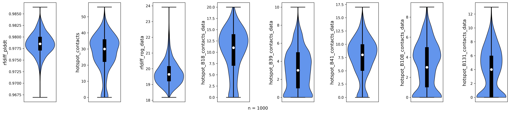
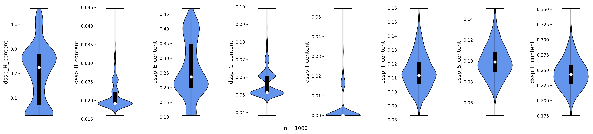
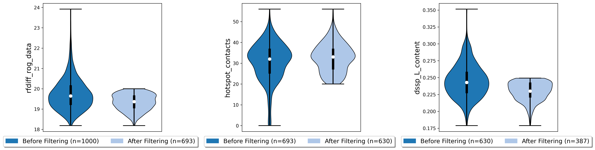
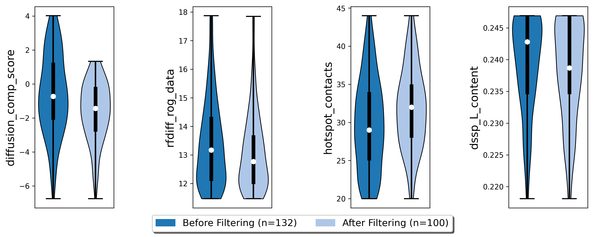

.. _binder_design:

Binder Design Tutorial
======================

We aren't BindCraft. But we can help you build your own binder design pipeline, just wait until we tell you how!
In this tutorial, we are going to design binders for the protein Epidermal Growth Factor Receptor (EGFR).
To achieve this goal, we need several protein design tools:

- `RFdiffusion (backbone generation) <https://github.com/RosettaCommons/RFdiffusion>`_
- `LigandMPNN (threading sequences onto backbones) <https://github.com/dauparas/LigandMPNN>`_
- `Rosetta (energy-based backbone optimization) <https://github.com/RosettaCommons/rosetta>`_
- `ESMFold (structure prediction) <https://github.com/facebookresearch/esm>`_
- `ColabFold (complex prediction) <https://github.com/YoshitakaMo/localcolabfold>`_

Make sure these are installed on your local machine and configured in the ProtFlow config file!

.. note::

   If you are having trouble setting up ProtFlow, please check out the Quickstart guide.  <!-- TODO: insert link -->

Introduction
------------

We are going to create a pipeline that requires the receptor structure (EGFR) as input. Luckily, this structure is available in the Protein Data Bank (PDB code: 6aru).
Using RFdiffusion, we will create de novo binders that should bind to certain regions on the receptor (so-called hotspot residues). Next, we are going to generate sequences
that fit to the diffused backbones with LigandMPNN, optimize the structures with Rosetta, and predict the sequences with ESMFold and Colabfold. The complete pipeline can be
found in the repository.  <!-- TODO: insert link -->
This tutorial assumes you are already familiar with how to set up ProtFlow runners and metrics. If you are not, please check out one of our other tutorials.

Hotspot residues
----------------

.. figure:: ../../assets/egfr_hotspot_residues.png
   :align: right
   :figwidth: 200px

   Structure of truncated EGFR. Hotspot residues are shown in magenta.

We identified 5 residues on EGFR that we want to use as hotspot residues: L325, H346, L348, A415, and I438. These residues are located on a hydrophobic patch of
EGFR in a region where cetuximab, a monoclonal antibody, binds to EGFR. We are defining these residues as ResidueSelections, a special ProtFlow class for selection of protein
residues. We modified our input PDB slightly, so that the target EGFR is on chain B. In addition, we truncated the EGFR structure to 162 residues to decrease runtime, as RFdiffusion
inference time depends on the size of the input structures.

.. code-block:: python

   from protflow.poses import Poses
   from protflow.residues import residue_selection

   # import all PDB files in input dir as poses
   poses = Poses(poses=args.input_dir, glob_suffix="*pdb", work_dir=args.output_dir)

   hotspot_residues = "B18,B39,B41,B108,B131" # residue numbers are different in the truncated EGFR!
   hotspot_residue_selection = residue_selection(hotspot_residues, delim=",")

   # add hotspot residues to poses df
   # assign each pose the residue selection of the hotspot residues
   poses.df["hotspot_residues_original"] = [hotspot_residues for _ in poses.poses_list()]
   # this residue selection will be updated post-diffusion (to track changing residue numbers)
   poses.df["hotspot_residues_postdiffusion"] = [hotspot_residues for _ in poses.poses_list()]

We assign each pose a ResidueSelection containing the hotspot residues twice: once to preserve the original hotspot residues, and in another column to update the selection
post-diffusion as the residue numbers change after structure generation with RFdiffusion.

RFdiffusion
-----------

RFdiffusion comes with a special potential for binder generation with hotspot residues, which we are going to use. For further details, please check out the
`RFdiffusion documentation <https://github.com/RosettaCommons/RFdiffusion>`_. We are also going to use the "Beta" model to increase topology diversity of diffused structures.
Our binder should have a length of 150 residues.

.. code-block:: python

   from protflow.jobstarters import SbatchArrayJobstarter
   from protflow.tools.rfdiffusion import RFdiffusion

   gpu_jobstarter = SbatchArrayJobstarter(max_cores=5, gpus=1)  # set up a jobstarter that can use GPUs
   rfdiffusion = RFdiffusion(jobstarter=gpu_jobstarter)  # set up rfdiffusion

   # define diffusion contig (B1-162 is the receptor EGFR, binder should be 150 residues)
   contig = "B1-162/0 150-150"
   # define path to Beta model (comes with RFdiffusion)
   beta_model_path = "/path/to/Complex_beta_ckpt.pt"

   # rfdiffusion options, same as when running rfdiffusion on the cmd line
   diff_opts = f"diffuser.T=50 'contigmap.contigs=[{contig}]' 'ppi.hotspot_res=[{hotspot_residues}]' inference.ckpt_override_path={beta_model_path}"

   # run rfdiffusion
   rfdiffusion.run(
       poses=poses,
       prefix='rfdiff',
       num_diffusions=200,
       multiplex_poses=5,
       options=diff_opts,
       fail_on_missing_output_poses=False,
       update_motifs=['hotspot_residues_postdiffusion'],
   )

We are multiplexing (or copying) our input pose (consisting of just the single EGFR .pdb file) 5 times and running 200 diffusions, creating 1000 output structures. Multiplexing is used to
parallelize inference, as we defined 5 cores with one GPU each in our jobstarter. We are also updating our hotspot ResidueSelection, as RFdiffusion outputs structures with continuous
residue numbers over both chains. Depending on your available computing power, it might take a while until diffusion is completed. The poses dataframe will now contain all diffused 
structures and the respective scores.

Post-diffusion analysis
-----------------------

We want to filter out all low-quality diffused structures. Our criteria are:

- globular binder (low radius of gyration)
- defined secondary structure (stability of binder)
- high number of contacts to hotspot residues (to ensure binder binds at the correct position)

.. code-block:: python

   from protflow.metrics.tmscore import TMalign
   from protflow.metrics.dssp import DSSP
   from protflow.metrics.ligand import LigandContacts
   from protflow.metrics.generic_metric_runner import GenericMetric

   # set up a jobstarter that runs just on CPUs
   small_cpu_jobstarter = SbatchArrayJobstarter(max_cores=10)  

   # set up metrics to calculate scores
   contacts = LigandContacts(ligand_chain="B", min_dist=0, max_dist=10, atoms=['CA'], jobstarter=small_cpu_jobstarter) # calculates number of C-alpha atoms within 10 Angstrom of any atom that is on chain B
   # the generic metric runner can run any function that takes a pose as input using a jobstarter
   rog_calculator = GenericMetric(module="protflow.utils.metrics", function="calc_rog_of_pdb", options={"chain": "A"}, jobstarter=small_cpu_jobstarter) # calculates radius of gyration for chain A
   rescontacts_calculator = GenericMetric(module="protflow.utils.metrics", function="residue_contacts", jobstarter=small_cpu_jobstarter) # calculates number of atoms/residues that are within a certain distance from a target atom or residue
   dssp = DSSP(jobstarter=small_cpu_jobstarter) # calculates secondary structure content
   
   # retrieve updated hotspot residues (same for all diffused backbones, as length of diffused backbones is always 150 residues)
   hotspot_residues_postdiffusion = poses.df["hotspot_residues_postdiffusion"].iloc[0]
   
   # calculate rog, general contacts and hotspot contacts
   rog_calculator.run(poses=poses, prefix="rfdiff_rog") # calculate ROG
   contacts.run(poses=poses, prefix="rfdiff_contacts", normalize_by_num_atoms=False) # calculate number of contacts between chain A and B
   dssp.run(poses=poses, prefix="dssp") # determine secondary structure content
   # calculate number of contacts for each hotspot residue
   for res in hotspot_residues_postdiffusion.to_list():
       rescontact_opts={"max_distance": 12, "target_chain": "B", "partner_chain": "A", "target_resnum": int(res[1:]), "target_atom_names": ["CA"], "partner_atom_names": ["CA"]}
       rescontacts_calculator.run(poses=poses, prefix=f"hotspot_{res}_contacts", options=rescontact_opts)

    # calculate overall hotspot contacts
    poses.df["hotspot_contacts"] = sum([poses.df[f"hotspot_{res}_contacts_data"] for res in hotspot_residues_postdiffusion.to_list()]) # sum up all contacts to hotspot residues

After we calculated all scores, we can visualize the data:

.. code-block:: python

   from protflow.utils.plotting import violinplot_multiple_cols
   
   # make some plots of the hotspot_contacts, RFDiffusion output and the secondary structure content
   cols = ["rfdiff_plddt" , "hotspot_contacts"]
   cols = cols + [f"hotspot_{res}_contacts_data" for res in hotspot_residues_postdiffusion.to_list()] # show contacts for each individual hotspot residue
   cols = cols + [col for col in poses.df.columns if col.startswith("dssp") and col.endswith("content")] # show content for each secondary structure element

   # create a plot and save it in the poses plots directory
   violinplot_multiple_cols(dataframe=poses.df, cols=cols, y_labels= cols, out_path=os.path.join(poses.plots_dir, "diffusion_scores.png"))

   Rfdiffusion pLDDT, total number of hotspot contacts, radius of gyration, and per-hotspot contacts for 1000 diffused backbones.

   Secondary structure content for 1000 diffused backbones. H = helix, B = residue in beta-bridge, E = extended strand, G = 3-helix, I = 5-helix, T = hydrogen-bonded turn, S = bend, L = loop.

Looking at the plots, we notice that some of our backbones have a high radius of gyration (rfdiff_rog_data) or a low number of hotspot contacts
(meaning they do not bind at the intended position). While most are predominantely helical (dssp_H_content) or contain beta-sheets (dssp_E_content), 
some have significant amount of unordered regions (dssp_L_content). We want to remove all of these poses using the Poses filtering options before we optimize the rest.

.. code-block:: python
   
   poses.filter_poses_by_value(score_col="rfdiff_rog_data", value=20, operator="<=", prefix="rfdiff_rog", plot=True) # remove all poses with ROG higher than 20
   poses.filter_poses_by_value(score_col="hotspot_contacts", value=20, operator=">=", prefix="rfdiff_hotspots_contacts", plot=True) # remove all poses with fewer total contacts to hotspot residues than the set cutoff
   poses.filter_poses_by_value(score_col="dssp_L_content", value = 0.25, operator="<", prefix = "L_content", plot = True) # remove all poses with more than 25% unordered (L) regions

Each filter will reduce the number of poses. To further narrow down our poses, we can calculate a composite score comprised of all scores that interest us, and filter for the 150 best 
poses according to this score. We assign a different importance (weight) to each scoreterm, and the sign of the weight depends on if higher or lower numbers indicate a good score.

.. code-block:: python
   
   # calculate composite score
   diffusion_comp_score_scoreterms = ["rfdiff_rog_data", "hotspot_contacts", "dssp_L_content"]
   diffusion_comp_score_weights = [1, -2, 1]
   poses.calculate_composite_score(name="diffusion_comp_score", scoreterms=diffusion_comp_score_scoreterms, weights=diffusion_comp_score_weights, plot=True)
   
   # filter for the top 150 poses
   poses.filter_poses_by_rank(score_col="comp_score_before_opt", n=150, prefix="comp_score", plot=True, plot_cols=diffusion_comp_score_scoreterms)

Now that we filtered down our backbones sufficiently, we can continue with sequence generation and iterative optimization to maximize in silico binding affinities.

Iterative Optimization
----------------------

RFdiffusion only generates backbones but not the corresponding sequences. For this, we are going to use a combination of LigandMPNN and Rosetta. To test whether our designed structures 
look as expected, we are going to predict the corresponding sequences and compare them to the design models. In addition, we are going to predict the binder-receptor complex and evaluate
binding affinities. The best structures will be passed on for another cycle of LigandMPNN-Rosetta-LigandMPNN and structure prediction, hopefully improving binding affinities with each cycle.

.. code-block:: python
   
   from protflow.tools.ligandmpnn import LigandMPNN
   
   ligandmpnn = LigandMPNN(jobstarter=gpu_jobstarter)
   
   cycle = 1

   # rfdiffusion outputs continous residue numbers over chains, so our 162-AA receptor ranges from residue 151 to 313 
   fixed_residues = ' '.join([f'B{i}' for i in range(151, 314)]) 
   mpnn_opts = f"--fixed_residues {fixed_residues}"

   # we create 5 sequenes per pose, and return the PDBs with the sequences threaded on the structures instead of the .fasta files
   # the receptor chain residues are kept fixed (mpnn_opts)
   ligandmpnn.run(poses=poses, prefix=f"cycle_{cycle}_seq_thread", nseq=5, model_type="soluble_mpnn", options=mpnn_opts, return_seq_threaded_pdbs_as_pose=True)

LigandMPNN created structures with amino acid sequences out of our backbones. To improve our backbones, we are going to employ Rosetta Relax, a specialized Rosetta protocol that optimizes
protein structures by minimizing energies via introduction of small movements. 

.. code-block:: python
   
   from protflow.tools.rosetta import Rosetta
   
   # define a cpu jobstarter for more demanding tasks
   cpu_jobstarter = SbatchArrayJobstarter(max_cores=1000)
   
   rosetta = Rosetta(jobstarter=cpu_jobstarter, fail_on_missing_output_poses=True)
   
   # relax poses
   relax_protocol = "path/to/relax.xml"
   fr_options = f"-parser:protocol {relax_protocol} -beta" # define options for rosetta relax runs (beta weights, and path to relax xml)
   rosetta.run(poses=poses, prefix=f"cycle_{cycle}_rlx", nstruct=3, options=fr_options, rosetta_application="rosetta_scripts.default.linuxgccrelease") # 3 relax trajectories per pose

   # calculate composite score containing surface aggregation propensity, total score, interaction energy between binder and receptor, and shape complementarity (all defined in Rosetta relax xml)
   relax_comp_scoreterms = [
    f"cycle_{cycle}_rlx_sap_score",
    f"cycle_{cycle}_rlx_total_score",
    f"cycle_{cycle}_rlx_intE_interaction_energy",
    f"cycle_{cycle}_rlx_shape_complementarity"]
   relax_comp_weights = [1, 2, 2, -1]
   poses.calculate_composite_score(name=f"cycle_{cycle}_threading_comp_score", scoreterms=relax_comp_scoreterms, weights=relax_comp_weights, plot=True)

   # apply filter to get best structure for each rfdiffusion output using group_col
   poses.filter_poses_by_rank(n=1, score_col=f"cycle_{cycle}_threading_comp_score", group_col="rfdiff_location")

   # generate sequences for relaxed poses
   ligandmpnn.run(poses=poses, prefix=f"cycle_{cycle}_mpnn", nseq=50, model_type="soluble_mpnn", options=mpnn_opts, return_seq_threaded_pdbs_as_pose=True)

For each diffused backbone, we generated 5 sequences with LigandMPNN and relaxed each one 3 times. After relaxing our poses, we filtered for the best structure of each diffused pose 
according to a combination of Surface Aggregation Propensity, total score, interaction energy between binder and receptor and shape complementarity. Now that we have energy-optimized 
backbones, we again create sequences using LigandMPNN. This combination of LigandMPNN-Rosetta-LigandMPNN improves the quality of the generated sequences for a given backbone. Next,
we need to evaluate if our sequences fold into the design models. For this, we are going to use ESMFold. Since ESMFold can only predict monomers, we have to remove the receptor first.
The custom ProtFlow class ChainRemover is suited for this task. Since we are only interested in predictions with high confidence, we again filter our poses.

.. code-block:: python
   
   from protflow.metrics.tmscore import TMalign
   from protflow.tools.esmfold import ESMFold
   from protflow.tools.protein_edits import ChainRemover
   
   chain_remover = ChainRemover(jobstarter=small_cpu_jobstarter)
   esmfold = ESMFold(jobstarter=gpu_jobstarter)
   
   chain_remover.run(poses=poses, prefix=f"cycle_{cycle}_rm_target", chains=["B"])

   # write .fasta files without target
   poses.convert_pdb_to_fasta(prefix=f"cycle_{cycle}_fasta", update_poses=True)

   # predict sequences with ESMFOLD
   esmfold.run(poses=poses, prefix=f"cycle_{cycle}_esm")

   # filter for prediction confidence (plddt)
   poses.filter_poses_by_value(score_col=f"cycle_{cycle}_esm_plddt", value=70, operator=">", prefix=f"cycle_{cycle}_esm_plddt", plot=True)

   # calculate tm score between prediction and relaxed pose
   tm_score_calculator.run(poses=poses, prefix=f"cycle_{cycle}_tm", ref_col=f"cycle_{cycle}_rlx_location")

   # remove predictions that don't look like relaxed pose
   poses.filter_poses_by_value(score_col=f"cycle_{cycle}_tm_TM_score_ref", value=0.9, operator=">", prefix=f"cycle_{cycle}_tm_score", plot=True)

   # calculate composite score
   poses.calculate_composite_score(name=f"cycle_{cycle}_esm_composite_score", scoreterms=[f"cycle_{cycle}_tm_TM_score_ref", f"cycle_{cycle}_esm_plddt"], weights=[-1,-2], plot=True)

   # filter to cycle input poses (max 15 poses per optimization cycle input pose)
   poses.filter_poses_by_rank(n=15, score_col=f"cycle_{cycle}_esm_composite_score", group_col="", plot=True, prefix=f"cycle_{cycle}_esm_comp_per_bb")

   # filter for maximum number of input poses for colabfold
   poses.filter_poses_by_rank(n=500, score_col=f"cycle_{cycle}_esm_composite_score", prefix=f"cycle_{cycle}_esm_comp", plot=True)