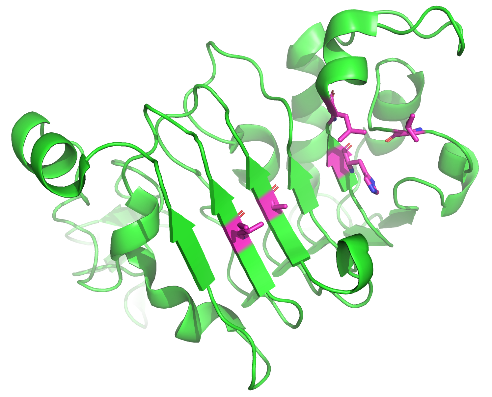
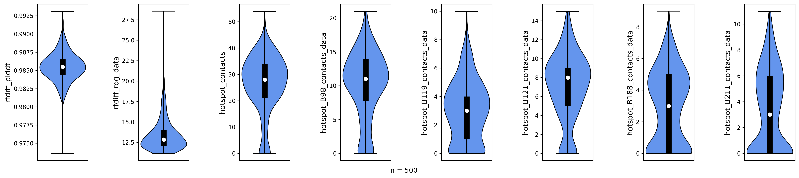
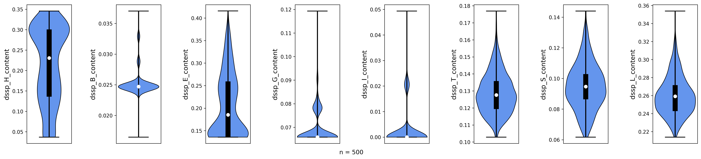
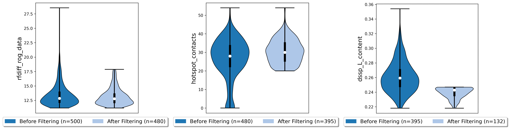
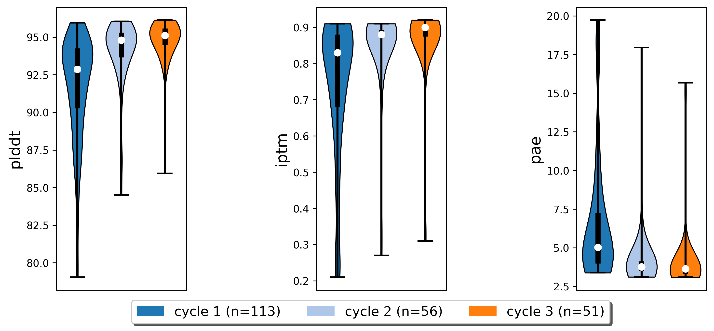
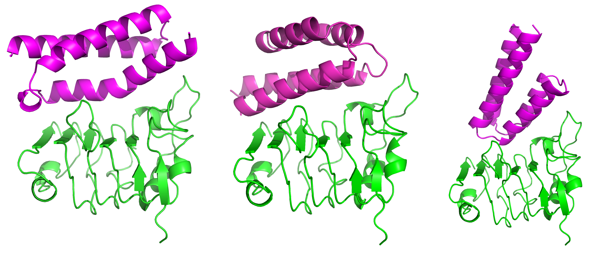
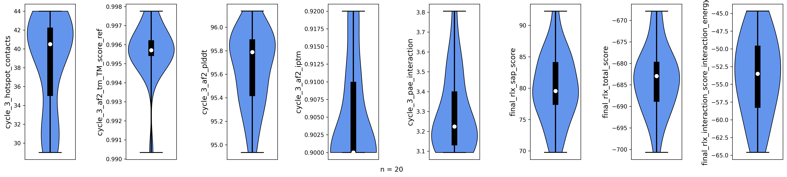

.. _binder_design:

Binder Design Tutorial
======================

We aren't BindCraft. But we can help you build your own binder design pipeline, just wait until we tell you how!
In this tutorial, we are going to design binders for the protein Epidermal Growth Factor Receptor (EGFR).
To achieve this goal, we need several protein design tools:

- `RFdiffusion <https://github.com/RosettaCommons/RFdiffusion>`_ (backbone generation) 
- `LigandMPNN <https://github.com/dauparas/LigandMPNN>`_ (threading sequences onto backbones) 
- `Rosetta <https://github.com/RosettaCommons/rosetta>`_ (energy-based backbone optimization) 
- `ESMFold <https://github.com/facebookresearch/esm>`_ (structure prediction) 
- `ColabFold <https://github.com/YoshitakaMo/localcolabfold>`_ (complex prediction) 

Make sure these are installed on your local machine and configured in the ProtFlow config file!

.. note::

   If you are having trouble setting up ProtFlow, please check out the
   :doc:`Quickstart guide </quickstart/index>`.

Introduction
------------

We are going to create a pipeline that requires the receptor structure (EGFR) as input. Luckily, this structure is available in the Protein Data Bank (PDB code: 6aru).
Using RFdiffusion, we will create de novo binders that should bind to certain regions on the receptor (so-called hotspot residues). Next, we are going to generate sequences
that fit to the diffused backbones with LigandMPNN, optimize the structures with Rosetta, and predict the sequences with ESMFold and Colabfold. The complete pipeline including the
input structure can be found in `this repository <https://github.com/TecnomaLaser/ProtFlow-binder-design-tutorial>`_.
This tutorial assumes you are already familiar with how to set up ProtFlow runners and metrics. If you are not, please check out one of our other tutorials.

Hotspot residues
----------------

   Structure of truncated EGFR. Hotspot residues are shown in magenta.

We identified 5 residues on EGFR that we want to use as hotspot residues: L325, H346, L348, A415, and I438. These residues are located on a hydrophobic patch of
EGFR in a region where cetuximab, a monoclonal antibody, binds to EGFR. We are defining these residues as ResidueSelections, a special ProtFlow class for selection of protein
residues. We modified our input PDB slightly, so that the target EGFR is on chain B. In addition, we truncated the EGFR structure to 162 residues to decrease runtime, as RFdiffusion
inference time depends on the size of the input structures. We assign each pose a ResidueSelection containing the hotspot residues twice: once to preserve the original hotspot residues, 
and in another column to update the selection post-diffusion as the residue numbers change after structure generation with RFdiffusion.

.. code-block:: python

   from protflow.poses import Poses
   from protflow.residues import residue_selection

   receptor_pdb = "path/to/egfr_truncated.pdb"
   output_dir = "path/to/output_dir"

   # import all PDB files in input dir as poses
   poses = Poses(poses=receptor_pdb, work_dir=output_dir)

   hotspot_residues = "B18,B39,B41,B108,B131" # residue numbers are different in the truncated EGFR!
   hotspot_residue_selection = residue_selection(hotspot_residues, delim=",")

   # add hotspot residues to poses df
   # assign each pose the residue selection of the hotspot residues
   poses.df["hotspot_residues_original"] = [hotspot_residues for _ in poses.poses_list()]
   # this residue selection will be updated post-diffusion (to track changing residue numbers)
   poses.df["hotspot_residues_postdiffusion"] = [hotspot_residues for _ in poses.poses_list()]

RFdiffusion
-----------

RFdiffusion comes with a special potential for binder generation with hotspot residues. We are also going to use the "Beta" model to increase
topology diversity of diffused structures. Our binder should have a length of 80 residues. Before we start diffusing, we extract sequence information of the receptor.

.. note::

   For further details on RFdiffusion options, the hotspot potential and Beta model, please check out the `RFdiffusion documentation <https://github.com/RosettaCommons/RFdiffusion>`_.

.. code-block:: python

   from protflow.utils.biopython_tools import load_structure_from_pdbfile, get_sequence_from_pose
   from protflow.jobstarters import SbatchArrayJobstarter
   from protflow.tools.rfdiffusion import RFdiffusion

   # extract the receptor sequence
   receptor_structure = load_structure_from_pdbfile(receptor_pdb)
   receptor_sequence = get_sequence_from_pose(receptor_structure)

   # set up jobstarters
   gpu_jobstarter = SbatchArrayJobstarter(max_cores=5, gpus=1)  # set up a jobstarter that can use GPUs
   rfdiffusion = RFdiffusion(jobstarter=gpu_jobstarter)  # set up rfdiffusion

   # define diffusion contig (B1-162 is the receptor EGFR, binder should be 80 residues)
   contig = "B1-162/0 80-80"
   # define path to Beta model (comes with RFdiffusion)
   beta_model_path = "/path/to/Complex_beta_ckpt.pt"

   # rfdiffusion options, same as when running rfdiffusion on the cmd line
   diff_opts = f"diffuser.T=50 'contigmap.contigs=[{contig}]' 'ppi.hotspot_res=[{hotspot_residues}]' inference.ckpt_override_path={beta_model_path}"

   # run rfdiffusion
   rfdiffusion.run(
       poses=poses,
       prefix='rfdiff',
       num_diffusions=100,
       multiplex_poses=5,
       options=diff_opts,
       fail_on_missing_output_poses=False,
       update_motifs=['hotspot_residues_postdiffusion'],
   )

We are multiplexing (or copying) our input pose (egfr_truncated.pdb) 5 times and running 100 diffusions, creating 500 output structures. Multiplexing is used to
parallelize inference, as we defined 5 cores with one GPU each in our jobstarter. We are also updating our hotspot ResidueSelection, as RFdiffusion outputs structures with continuous
residue numbers over both chains. Depending on your available computing power, it might take a while until diffusion is completed. The poses dataframe will now contain all diffused 
structures and the respective scores.

Post-diffusion analysis
-----------------------

We want to filter out all low-quality diffused structures. Our criteria are:

- globular binder (low radius of gyration)
- defined secondary structure (stability of binder)
- high number of contacts to hotspot residues (to ensure binder binds at the correct position)

.. code-block:: python

   from protflow.metrics.dssp import DSSP
   from protflow.metrics.ligand import LigandContacts
   from protflow.metrics.generic_metric_runner import GenericMetric

   # set up a jobstarter that runs just on CPUs
   small_cpu_jobstarter = SbatchArrayJobstarter(max_cores=10)  

   # set up metrics to calculate scores
   contacts = LigandContacts(ligand_chain="B", min_dist=0, max_dist=10, atoms=['CA'], jobstarter=small_cpu_jobstarter) # calculates number of C-alpha atoms within 10 Angstrom of any atom that is on chain B
   # the generic metric runner can run any function that takes a pose as input using a jobstarter
   rog_calculator = GenericMetric(module="protflow.utils.metrics", function="calc_rog_of_pdb", options={"chain": "A"}, jobstarter=small_cpu_jobstarter) # calculates radius of gyration for chain A
   rescontacts_calculator = GenericMetric(module="protflow.utils.metrics", function="residue_contacts", jobstarter=small_cpu_jobstarter) # calculates number of atoms/residues that are within a certain distance from a target atom or residue
   dssp = DSSP(jobstarter=small_cpu_jobstarter) # calculates secondary structure content
   
   # retrieve updated hotspot residues (same for all diffused backbones, as length of diffused backbones is always 80 residues)
   hotspot_residues_postdiffusion = poses.df["hotspot_residues_postdiffusion"].iloc[0]
   
   # calculate rog, general contacts and hotspot contacts
   rog_calculator.run(poses=poses, prefix="rfdiff_rog") # calculate ROG
   contacts.run(poses=poses, prefix="rfdiff_contacts", normalize_by_num_atoms=False) # calculate number of contacts between chain A and B
   dssp.run(poses=poses, prefix="dssp") # determine secondary structure content
   # calculate number of contacts for each hotspot residue
   for res in hotspot_residues_postdiffusion.to_list(): # iterate over hotspot residues
      chain, resnum = [res[0], res[1:]] # extract chain and residue number
      rescontact_opts={"max_distance": 12, "target_chain": chain, "partner_chain": "A", "target_resnum": int(resnum), "target_atom_names": ["CA"], "partner_atom_names": ["CA"]} # define options
      rescontacts_calculator.run(poses=poses, prefix=f"hotspot_{res}_contacts", options=rescontact_opts)

    # calculate overall hotspot contacts
    poses.df["hotspot_contacts"] = sum([poses.df[f"hotspot_{res}_contacts_data"] for res in hotspot_residues_postdiffusion.to_list()]) # sum up all contacts to hotspot residues

After we calculated all scores, we can visualize the data:

.. code-block:: python

   from protflow.utils.plotting import violinplot_multiple_cols
   
   # make a plot of the hotspot_contacts
   cols_contact = ["rfdiff_plddt" , "rfdiff_rog_data", "hotspot_contacts"] + [f"hotspot_{res}_contacts_data" for res in hotspot_residues_postdiffusion.to_list()] # show contacts for each individual hotspot residue
   violinplot_multiple_cols(dataframe=poses.df, cols=cols_contact, y_labels=cols_contact, out_path=os.path.join(poses.plots_dir, "diff_contacts.png"))

   # make a plot of the secondary structure content
   ss_content_cols = [col for col in poses.df.columns if col.startswith("dssp") and col.endswith("content")] # show content for each secondary structure element
   violinplot_multiple_cols(dataframe=poses.df, cols=ss_content_cols, y_labels=ss_content_cols, out_path=os.path.join(poses.plots_dir, "diff_ss_content.png"))

   Rfdiffusion pLDDT, radius of gyration, total number of hotspot contacts and per-hotspot contacts for 500 diffused backbones.

   Secondary structure content for 500 diffused backbones. H = helix, B = residue in beta-bridge, E = extended strand, G = 3-helix, I = 5-helix, T = hydrogen-bonded turn, S = bend, L = loop.

Looking at the plots, we notice that some of our backbones have a high radius of gyration (rfdiff_rog_data) or a low number of hotspot contacts
(meaning they do not bind at the intended position). While most are predominantely helical (dssp_H_content) or contain beta-sheets (dssp_E_content), 
some have significant amount of unordered regions (dssp_L_content). We want to remove all of these poses using the Poses filtering options before we optimize the rest.

.. code-block:: python
   
   poses.filter_poses_by_value(score_col="rfdiff_rog_data", value=18, operator="<=", prefix="rfdiff_rog", plot=True) # remove all poses with ROG higher than 20
   poses.filter_poses_by_value(score_col="hotspot_contacts", value=20, operator=">=", prefix="rfdiff_hotspots_contacts", plot=True) # remove all poses with fewer total contacts to hotspot residues than the set cutoff
   poses.filter_poses_by_value(score_col="dssp_L_content", value = 0.25, operator="<", prefix = "L_content", plot = True) # remove all poses with more than 25% unordered (L) regions

Each filter will reduce the number of poses. To further narrow down our poses, we can calculate a composite score comprised of all scores that interest us, and filter for the 100 best 
poses according to this score. We assign a different importance (weight) to each scoreterm, and the sign of the weight depends on if higher or lower numbers indicate a good score.

.. code-block:: python
   
   # calculate composite score
   diffusion_comp_score_scoreterms = ["rfdiff_rog_data", "hotspot_contacts", "dssp_L_content"]
   diffusion_comp_score_weights = [1, -2, 1]
   poses.calculate_composite_score(name="diffusion_comp_score", scoreterms=diffusion_comp_score_scoreterms, weights=diffusion_comp_score_weights, plot=True)
   
   # filter for the top 100 poses
   poses.filter_poses_by_rank(score_col="comp_score_before_opt", n=100, prefix="comp_score", plot=True, plot_cols=diffusion_comp_score_scoreterms)

.. figure:: ../../assets/binder_tutorial/egfr_diff_comp_score_filter.png
   :align: center
   :figwidth: 700px

Now that we filtered down our backbones sufficiently, we can continue with sequence generation and iterative optimization to maximize in silico binding affinities.

Iterative Optimization
----------------------

RFdiffusion only generates backbones but not the corresponding sequences. For this, we are going to use a combination of LigandMPNN and Rosetta. To test whether our designed structures 
look as expected, we are going to predict the corresponding sequences and compare them to the design models. In addition, we are going to predict the binder-receptor complex and evaluate
binding affinities. The best structures will be passed on for another cycle of LigandMPNN-Rosetta-LigandMPNN and structure prediction, hopefully improving binding affinities with each cycle.

.. code-block:: python
   
   from protflow.tools.ligandmpnn import LigandMPNN
   
   ligandmpnn = LigandMPNN(jobstarter=gpu_jobstarter)
   
   cycle = 1

   # rfdiffusion outputs continous residue numbers over chains, so our 162-AA receptor ranges from residue 151 to 313 
   fixed_residues = ' '.join([f'B{i}' for i in range(151, 314)]) 
   mpnn_opts = f"--fixed_residues {fixed_residues}"

   # we create 5 sequenes per pose, and return the PDBs with the sequences threaded on the structures instead of the .fasta files
   # the receptor chain residues are kept fixed (mpnn_opts)
   ligandmpnn.run(poses=poses, prefix=f"cycle_{cycle}_seq_thread", nseq=5, model_type="soluble_mpnn", options=mpnn_opts, return_seq_threaded_pdbs_as_pose=True)

LigandMPNN created structures with amino acid sequences out of our backbones. To improve our backbones, we are going to employ Rosetta Relax, a specialized Rosetta protocol that optimizes
protein structures by minimizing energies via introduction of small movements. 

.. code-block:: xml

   <ROSETTASCRIPTS>
      <SCOREFXNS>
         <ScoreFunction name="beta" weights="beta"/>
         <ScoreFunction name="beta_cst" weights="beta_cst" />
      </SCOREFXNS>
      <RESIDUE_SELECTORS>
         <Chain name="chainA" chains="A" />
         <Chain name="chainB" chains="B" />
      </RESIDUE_SELECTORS>
      <TASKOPERATIONS>
      </TASKOPERATIONS>
      <MOVE_MAP_FACTORIES>
      </MOVE_MAP_FACTORIES>
      <SIMPLE_METRICS>
         <SapScoreMetric name="sapscore" />
         <InteractionEnergyMetric name="interaction_score" custom_type="interaction_score" residue_selector="chainA" residue_selector2="chainB" scorefxn="beta" />
      </SIMPLE_METRICS>
      <FILTERS>
      </FILTERS>
      <MOVERS>
         <RunSimpleMetrics name="calc_proteinscores" metrics="sapscore,interaction_score" />
         <VirtualRoot name="set_virtual_root" />
         <AddConstraints name="add_bb_ca_cst" >
                           <CoordinateConstraintGenerator name="set_bb_ca_constraint" ca_only="true" />
         </AddConstraints>
         <FastRelax name="fastrelax" scorefxn="beta_cst" />
      </MOVERS>
      <PROTOCOLS>
         <Add mover_name="set_virtual_root" />
         <Add mover_name="add_bb_ca_cst" />
         <Add mover_name="fastrelax" />
         <Add mover_name="calc_proteinscores" />
      </PROTOCOLS>
      <OUTPUT scorefxn="beta" />
   </ROSETTASCRIPTS>

.. note::

   For further information on Rosetta, RosettaScripts and Rosetta-XML-protocols, please check out the `RosettaCommons <https://docs.rosettacommons.org/docs/latest/Home>`_.

.. code-block:: python
   
   from protflow.tools.rosetta import Rosetta
   
   # define a cpu jobstarter for more demanding tasks
   cpu_jobstarter = SbatchArrayJobstarter(max_cores=1000)
   
   rosetta = Rosetta(jobstarter=cpu_jobstarter, fail_on_missing_output_poses=True)
   
   # relax poses
   relax_protocol = "path/to/fastrelax_interaction.xml"
   fr_options = f"-parser:protocol {relax_protocol} -beta" # define options for rosetta relax runs (beta weights, and path to relax xml)
   rosetta.run(poses=poses, prefix=f"cycle_{cycle}_rlx", nstruct=3, options=fr_options, rosetta_application="rosetta_scripts.default.linuxgccrelease") # 3 relax trajectories per pose

   # calculate composite score containing surface aggregation propensity, total score and interaction energy between binder and receptor (all defined in Rosetta relax xml)
   relax_comp_scoreterms = [
    f"cycle_{cycle}_rlx_sap_score",
    f"cycle_{cycle}_rlx_total_score",
    f"cycle_{cycle}_rlx_intE_interaction_energy",
    ]
   relax_comp_weights = [1, 2, 2]
   poses.calculate_composite_score(name=f"cycle_{cycle}_threading_comp_score", scoreterms=relax_comp_scoreterms, weights=relax_comp_weights, plot=True)

   # apply filter to get best structure for each rfdiffusion output using group_col
   poses.filter_poses_by_rank(n=1, score_col=f"cycle_{cycle}_threading_comp_score", group_col="rfdiff_location")

   # generate sequences for relaxed poses
   ligandmpnn.run(poses=poses, prefix=f"cycle_{cycle}_mpnn", nseq=30, model_type="soluble_mpnn", options=mpnn_opts, return_seq_threaded_pdbs_as_pose=True)

For each diffused backbone, we generated 5 sequences with LigandMPNN and relaxed each one 3 times. After relaxing our poses, we filtered for the best structure of each diffused pose 
according to a combination of Surface Aggregation Propensity, total score an interaction energy between binder and receptor. Now that we have energy-optimized 
backbones, we again create sequences using LigandMPNN. This combination of LigandMPNN-Rosetta-LigandMPNN improves the quality of the generated sequences for a given backbone. Next,
we need to evaluate if our sequences fold into the design models. For this, we are going to use ESMFold because it offers faster inference time compared to ColabFold.
Since ESMFold can only predict monomers, we have to remove the receptor first. The custom ProtFlow class ChainRemover is suited for this task. Since we are only interested in 
predictions with high confidence, we again filter our poses. The top 200 poses according to pLDDT that agree with the design model are passed on to the next step.

.. code-block:: python
   
   from protflow.metrics.tmscore import TMalign
   from protflow.tools.esmfold import ESMFold
   from protflow.tools.protein_edits import ChainRemover
   
   chain_remover = ChainRemover(jobstarter=small_cpu_jobstarter)
   esmfold = ESMFold(jobstarter=gpu_jobstarter)
   
   # remove receptor chain
   chain_remover.run(poses=poses, prefix=f"cycle_{cycle}_rm_target", chains=["B"])

   # write .fasta files without target
   poses.convert_pdb_to_fasta(prefix=f"cycle_{cycle}_fasta", update_poses=True)

   # predict sequences with ESMFOLD
   esmfold.run(poses=poses, prefix=f"cycle_{cycle}_esm")

   # filter for prediction confidence (plddt)
   poses.filter_poses_by_value(score_col=f"cycle_{cycle}_esm_plddt", value=70, operator=">", prefix=f"cycle_{cycle}_esm_plddt", plot=True)

   # calculate tm score between prediction and relaxed pose
   tm_score_calculator.run(poses=poses, prefix=f"cycle_{cycle}_tm", ref_col=f"cycle_{cycle}_rlx_location")

   # remove predictions that don't look like relaxed pose
   poses.filter_poses_by_value(score_col=f"cycle_{cycle}_tm_TM_score_ref", value=0.9, operator=">", prefix=f"cycle_{cycle}_tm_score", plot=True)

   # calculate composite score
   poses.calculate_composite_score(name=f"cycle_{cycle}_esm_composite_score", scoreterms=[f"cycle_{cycle}_tm_TM_score_ref", f"cycle_{cycle}_esm_plddt"], weights=[-1,-2], plot=True)

   # filter to cycle input poses (max 10 poses per optimization cycle input pose)
   poses.filter_poses_by_rank(n=10, score_col=f"cycle_{cycle}_esm_composite_score", group_col="rfdiff_location", plot=True, prefix=f"cycle_{cycle}_esm_comp_per_bb")

   # filter for maximum number of input poses for colabfold
   poses.filter_poses_by_rank(n=200, score_col=f"cycle_{cycle}_esm_composite_score", prefix=f"cycle_{cycle}_esm_comp", plot=True)

.. figure:: ../../assets/binder_tutorial/egfr_af2_input_filter.png
   :align: center
   :figwidth: 700px

Next, we want to evaluate if our binder actually binds to the target using Colabfold (an AlphaFold2 implementation). First, we have to add the target sequence to our poses. Our poses need to be in .fasta format.

.. code-block:: python

   from protflow.tools.protein_edits import SequenceAdder
   from protflow.tools.colabfold import Colabfold, calculate_poses_interaction_pae

   # set up sequence adder and colabfold
   seq_adder = SequenceAdder(jobstarter=small_cpu_jobstarter) 
   colabfold = Colabfold(jobstarter=gpu_jobstarter)

   # convert pdb to fasta
   poses.convert_pdb_to_fasta(prefix=f"cycle_{cycle}_complex_fasta", update_poses=True)

   # add target sequence
   seq_adder.run(prefix=f"cycle_{cycle}_target_seq", sequence=receptor_sequence) # reusing the sequence extracted pre-diffusion and adding a chain separator

   # define colabfold options and run it
   colabfold_opts = "--num-models 3 --num-recycle 3"
   colabfold.run(poses=poses, prefix=f"cycle_{cycle}_af2", options=colabfold_opts)

   # filter for high confidence predictions
   poses.filter_poses_by_value(score_col=f"cycle_{cycle}_af2_plddt", value=af2_plddt_cutoff, operator=">", prefix=f"cycle_{cycle}_af2_plddt", plot=True)

   # filter for high agreement between design model and prediction
   tm_score_calculator.run(poses=poses, prefix=f"cycle_{cycle}_af2_tm", ref_col=f"cycle_{cycle}_rlx_location")
   poses.filter_poses_by_value(score_col=f"cycle_{cycle}_af2_tm_TM_score_ref", value=0.9, operator=">", prefix=f"cycle_{cycle}_af2_tm_score", plot=True)

   for res in hotspot_residue_selection.to_list():
      resnum, chain = get_resnum_chain(res)
      logging.info(f"{resnum}, {chain}, {type(chain)}")
      tmp.append([chain, resnum])
      rescontact_opts={"max_distance": 12, "target_chain": "B", "partner_chain": "A", "target_resnum": int(res[1:]), "target_atom_names": ["CA"], "partner_atom_names": ["CA"]}
      rescontacts_calculator.run(poses=poses, prefix=f"cycle_{cycle}_hotspot_{chain+str(resnum)}_contacts", options=rescontact_opts)

   # calculate overall hotspot contacts
   poses.df[f"cycle_{cycle}_hotspot_contacts"] = sum([poses.df[f"cycle_{cycle}_hotspot_{res}_contacts_data"] for res in hotspot_residue_selection.to_list()])

   # filter out all poses where the contact between target and binder is below the cutoff
   poses.filter_poses_by_value(score_col=f"cycle_{cycle}_hotspot_contacts", value=20, operator=">", prefix=f"cycle_{cycle}_hotspots_contacts", plot=True)

   calculate_poses_interaction_pae(
      poses=poses,
      prefix=f"cycle_{cycle}",
      pae_list_col=f"cycle_{cycle}_af2_pae_list",
      binder_start=0, # first residue of binder (0-indexed)
      binder_end=79, # last residue of binder
      target_start=80, # first residue of receptor
      target_end=241) # last residue of receptor (binder length + receptor length)

   # define colabfold composite scoreterms and weights
   colabfold_comp_cols = [
            f"cycle_{cycle}_hotspot_contacts",
            f"cycle_{cycle}_af2_tm_TM_score_ref",
            f"cycle_{cycle}_af2_plddt",
            f"cycle_{cycle}_af2_iptm",
            f"cycle_{cycle}_pae_interaction"]
   colabfold_comp_weigths = [-1, -1, -2, -3, 4]
   
   # calculate a composite score of colabfold metrics
   poses.calculate_composite_score(
      name = f"cycle_{cycle}_opt_composite_score",
      scoreterms = colabfold_comp_cols,
      weights = colabfold_comp_weigths,
      plot = True
   )
   
   #filter the poses:
   poses.filter_poses_by_rank(
      n = 5, # output poses per unique diffusion backbone
      score_col = f"cycle_{cycle}_opt_composite_score",
      prefix = f"cycle_{cycle}_opt_composite_score",
      plot = True,
      plot_cols=[
            f"cycle_{cycle}_hotspot_contacts",
            f"cycle_{cycle}_af2_tm_TM_score_ref",
            f"cycle_{cycle}_af2_plddt",
            f"cycle_{cycle}_af2_iptm",
            f"cycle_{cycle}_pae_interaction"
      ],
      group_col = "rfdiff_location"   
   )

   # for checking the ouput
   poses.save_poses(os.path.join(poses.work_dir, f"cycle_{cycle}_output"))
   poses.save_scores(os.path.join(poses.work_dir, f"cycle_{cycle}_scores.json"))

.. figure:: ../../assets/binder_tutorial/egfr_cycle1_results.png
   :align: center
   :figwidth: 700px

We filtered our poses to the best 5 structures per unique diffusion backbone according to our composite score scoreterms, which are comprised of the number of hotspot contacts, 
the TM score between design model and prediction, the ColabFold pLDDT, the interface predicted template modelling score (iPTM), and the predicted aligned error (PAE).

.. note::

   Further information on ColabFold/AlphaFold2 pLDDT, iPTM and PAE scores can be found `here <https://www.ebi.ac.uk/training/online/courses/alphafold/inputs-and-outputs/evaluating-alphafolds-predicted-structures-using-confidence-scores/>`_.

Looking at the poses, you will notice that their names are quite long. This is because each tool added an index layer to the pose name. We can remove these suffixes for a cleaner look.

.. code-block:: python

   poses.reindex_poses(prefix=f"cycle_{cycle}_reindex", force_reindex=True, group_col="rfdiff_location") # reset the number of index layers

This will reset the names to the ones specified in group_col, then add another suffix layer (_0001, _0002, etc) to ensure each pose name is unique. This completes our first iterative optimization cycle.
We can continue with the next cycle by moving all code inside a loop:

.. code-block:: python

   num_cycles = 3
   for cycle in range(1, num_cycles+1):
      # run all steps of the iterative optimization inside this loop
      ...

   AF2 Metrics for output poses of each cycle.

Iterative refinement improved scores in our binder design pipeline.

Final analysis
--------------

After the final cycle is completed, we run Rosetta again to calculate some scores:

.. code-block:: python

   # relax all optimized structures & calculate scores
   rosetta.run(poses=poses, prefix="final_rlx", nstruct=3, options=fr_options, rosetta_application="rosetta_scripts.default.linuxgccrelease")

   # filter for pose with lowest total score for each pose
   poses.filter_poses_by_rank(
      n = 1,
      score_col = "final_rlx_total_score",
      prefix = "final_rlx_total_score",
      plot = True,
      remove_layers = 1 # subtract one index layer then group, same result as group_col="final_rlx_location"
   )

   # calculate a final composite score:
   final_comp_cols = colabfold_comp_cols + ["final_rlx_sap_score",  "final_rlx_total_score", "final_rlx_interaction_score_interaction_energy"]
   final_comp_weights = colabfold_comp_weigths + [1, 1, 1]
   poses.calculate_composite_score(name="final_comp_score", scoreterms=final_comp_cols, weights=final_comp_weights, plot=True)

   # filter for the final top 20 poses
   poses.filter_poses_by_rank(
      n = 20,
      score_col = "final_comp_score",
      prefix = "final_comp_score",
      plot = True,
      plot_cols=final_comp_cols,
   )

   # save poses
   poses.save_poses(os.path.join(poses.work_dir, "results"))

   # plot final scores
   violinplot_multiple_cols(dataframe=poses.df, cols=final_comp_cols, y_labels=final_comp_cols, out_path=os.path.join(results, "scores.png"))

   Structures of truncated EGFR (green) in complex with de novo binders (magenta).

   Metrics for top 20 output poses.

This completes the binder design tutorial. The complete binder design script can be found on `GitHub <https://github.com/TecnomaLaser/ProtFlow-binder-design-tutorial>`_.